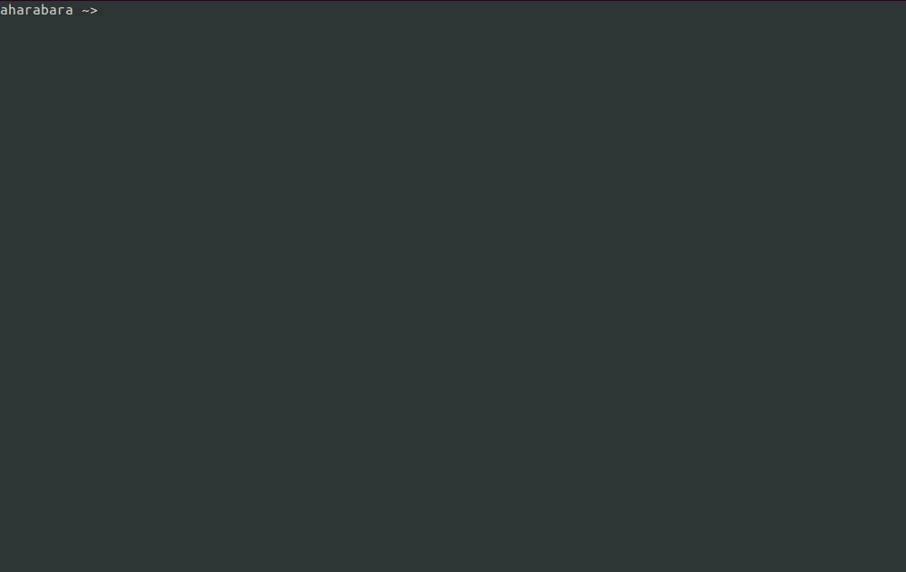

### HTodo :metal::sunglasses::metal:

Terminal todo application implemented using  [aharabara/habarnam](https://github.com/aharabara/habarnam).

Give a :star: if like it and write me if you don't and we will make it better.

<p align="center">
  
</p>

Usage:
```bash
# install dependencies
composer install

# then install ext-ncurses with its patches, so it will work for php 7.*
# and add 'extension=ncurses.so' to your php.ini
./vendor/aharabara/habarnam/install.sh

# then run this application
php -f index.php 

# or add an alias to your ~/.bashrc file
alias htodo="php -f ${path_to_HTodo}/htodo/index.php"
```